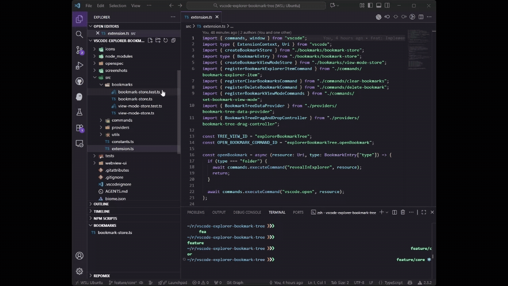

# Explorer Bookmark Tree

Explorer Bookmark Tree adds a dedicated view to the VS Code Explorer so you can collect your frequently used files and folders in one place. Bookmarks stay in sync across sessions and are always a click away.



## Features

- Bookmark any file or folder directly from the Explorer context menu or a multi-selection.
- Inspect bookmarks in a dedicated Explorer pane that supports both list and tree layouts.
- Toggle between list and tree views from the view toolbar without losing the current selection.
- Expand or collapse the entire tree at once with the dedicated toggle button in tree view.
- Drag and drop entries to reorder bookmarks when the list layout is active.
- Open files instantly or reveal bookmarked folders in the Explorer with a single click.
- Clear the entire bookmark collection when you need to start over.

## Usage

1. Open the Explorer view and locate the **Bookmarks** panel provided by the extension.
2. Right-click any file or folder in the Explorer and choose **Explorer Bookmark Tree: Add Bookmark**. Multi-select is supported.
3. Switch between **Bookmarks: View as List** and **Bookmarks: View as Tree** using the toolbar icons in the view title.
4. In tree view, use **Bookmarks: Toggle Expand/Collapse** to open or fold every folder in the tree with one click.
5. Click a bookmarked file to open it, or a folder to reveal it in the Explorer. Use drag and drop in list mode to reorder items.
6. Remove single bookmarks through the inline delete button or clear the entire list with **Bookmarks: Clear All**.

## Commands

- `Explorer Bookmark Tree: Add Bookmark` (`explorerBookmarkTree.bookmarkExplorerItem`)
- `Explorer Bookmark Tree: Open Bookmark` (`explorerBookmarkTree.openBookmark`)
- `Explorer Bookmark Tree: Remove Bookmark` (`explorerBookmarkTree.deleteBookmark`)
- `Bookmarks: View as List` (`explorerBookmarkTree.viewMode.list`)
- `Bookmarks: View as Tree` (`explorerBookmarkTree.viewMode.tree`)
- `Bookmarks: Toggle Expand/Collapse` (`explorerBookmarkTree.toggleExpandCollapse`)
- `Bookmarks: Expand All` (`explorerBookmarkTree.expandAllFolders`)
- `Bookmarks: Collapse All` (`explorerBookmarkTree.collapseAllFolders`)
- `Bookmarks: Clear All` (`explorerBookmarkTree.clearBookmarks`)

Each command is available from the Command Palette. Context menu entries appear in the Explorer and inside the bookmark view where it makes sense.

## Project Structure

```
.
├── src/
│   ├── bookmarks/             # Persistent storage and view mode state
│   ├── commands/              # Command registrations for bookmarks and view modes
│   ├── providers/             # Tree data provider and drag-and-drop controller
│   ├── utils/                 # Shared helpers
│   └── extension.ts           # Extension entry point
├── webview-ui/                # Webview bundle (reserved for future UI extensions)
├── screenshots/               # Marketing assets used in documentation
├── package.json               # Extension manifest and scripts
└── ...
```

## Development

### Prerequisites

- Node.js 16 or newer
- VS Code 1.84.0 or newer

### Setup

```bash
git clone https://github.com/atman-33/vscode-explorer-bookmark-tree.git
cd vscode-explorer-bookmark-tree
npm run install:all
```

### Run the extension

- Press `F5` in VS Code to launch an Extension Development Host with Explorer Bookmark Tree installed.
- Use `npm run watch` to recompile the extension and webview assets while developing.

## Available Scripts

- `npm run install:all` – install dependencies for both the extension and the webview bundle.
- `npm run build` – bundle the extension and the webview assets for production.
- `npm run lint` – run Biome via Ultracite to lint the project.
- `npm run format` – auto-format the codebase using the shared Biome config.
- `npm run test` – execute Vitest test suites.
- `npm run package` – create a `.vsix` package for side-loading the extension.

## License

Explorer Bookmark Tree is distributed under the [MIT License](./LICENSE).
